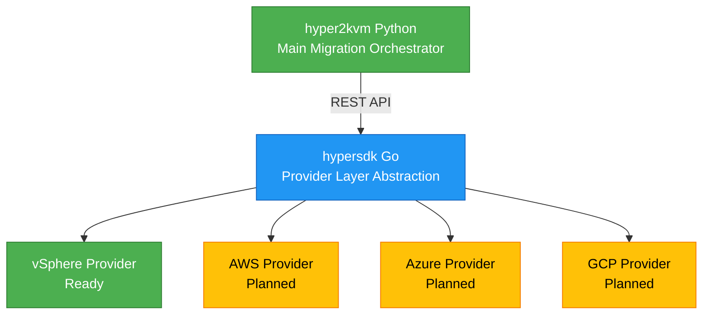

# hypersdk

**Multi-cloud VM export provider layer for the hyper2kvm migration toolkit**

[](https://www.gnu.org/licenses/lgpl-3.0)
[](https://go.dev/)
[](https://github.com/ssahani/hypersdk)

## 🎯 Overview

`hypersdk` is a high-performance, daemon-based VM export system that provides a **provider layer abstraction** for multiple clouds. It handles VM discovery, export, download, and metadata operations across different cloud platforms.

## 📹 Video Demos

> **Want to see it in action?** Check out our demo videos showing the tools in operation!

<!-- TODO: Add demo videos here after recording
### Quick Start Demo
<video src="https://user-attachments.githubusercontent.com/.../quick-demo.mp4"></video>

### Interactive Export Demo


### VM Discovery & Management
[](https://asciinema.org/a/XXXXXXX)
-->

For recording your own demos, see [demos/RECORDING-GUIDE.md](demos/RECORDING-GUIDE.md)

### Supported Providers

- ✅ **vSphere** (VMware vCenter/ESXi) - Production Ready
- 🔜 **AWS** (Amazon EC2) - Coming Soon
- 🔜 **Azure** (Microsoft Azure VMs) - Coming Soon
- 🔜 **GCP** (Google Compute Engine) - Coming Soon

### Architecture



## ✨ Features

### Core Capabilities

- **Direct SDK Integration** - Native Go SDK clients (no external binaries)
- **Beautiful Terminal UI** - Modern pterm-based interface with animations
- **REST JSON API** - Full-featured HTTP API for automation
- **Daemon Architecture** - Background service with systemd integration
- **Configuration Management** - YAML config files + environment variables
- **Concurrent Processing** - Goroutine-based parallel VM exports
- **Resumable Downloads** - Automatic retry with exponential backoff
- **Progress Tracking** - Real-time progress bars and ETAs
- **Production Ready** - Comprehensive error handling, logging, timeouts

### Three Tools

| Binary | Purpose | Use Case |
|--------|---------|----------|
| `hyperexport` | Interactive CLI | Manual exports with beautiful UI |
| `hypervisord` | Background daemon | Automation, REST API, batch processing |
| `hyperctl` | Migration Commander | Interactive TUI migration, daemon control, job management |

## 🚀 Quick Start

### Installation from Source

```bash
# Clone repository
git clone https://github.com/ssahani/hypersdk
cd hypersdk

# Build binaries
go build -o hyper2kvm ./cmd/hyper2kvm
go build -o hypervisord ./cmd/hypervisord
go build -o hyperctl ./cmd/hyperctl

# Install (requires root)
sudo ./install.sh
```

### Installation from RPM (Fedora/RHEL/CentOS)

```bash
# Install package
sudo dnf install hypersdk

# Configure
sudo vi /etc/hypervisord/config.yaml

# Start daemon
sudo systemctl start hypervisord
sudo systemctl enable hypervisord
```

### Configuration

#### Option 1: Environment Variables

```bash
export GOVC_URL='https://vcenter.example.com/sdk'
export GOVC_USERNAME='administrator@vsphere.local'
export GOVC_PASSWORD='your-password'
export GOVC_INSECURE=1
export DAEMON_ADDR='localhost:8080'
export LOG_LEVEL='info'
```

#### Option 2: Configuration File

Create `/etc/hypervisord/config.yaml`:

```yaml
VCenterURL: "https://vcenter.example.com/sdk"
Username: "administrator@vsphere.local"
Password: "your-password"
Insecure: true
DaemonAddr: "localhost:8080"
LogLevel: "info"
DownloadWorkers: 4
```

## 📖 Usage Examples

### Interactive CLI

```bash
# Launch interactive mode
./hyperexport

# Beautiful UI will guide you through:
# 1. VM discovery
# 2. Interactive selection
# 3. Real-time progress tracking
```

### Daemon Mode

```bash
# Start daemon
./hypervisord --config /etc/hypervisord/config.yaml

# Or with flags
./hypervisord --addr localhost:8080 --log-level debug
```

### Control CLI

```bash
# Submit single VM export
hyperctl submit -vm "/datacenter/vm/my-vm" -output "/tmp/export"

# Submit from YAML file
hyperctl submit -file job.yaml

# Query all jobs
hyperctl query -all

# Get daemon status
hyperctl status

# Cancel a job
hyperctl cancel -id <job-id>
```

### Job Definition (YAML)

**Single VM** (`job.yaml`):
```yaml
name: "vm-export-1"
vm_path: "/datacenter/vm/my-vm"
output_path: "/tmp/export"
options:
  parallel_downloads: 4
  remove_cdrom: true
```

**Batch** (`batch.yaml`):
```yaml
jobs:
  - name: "vm-1"
    vm_path: "/datacenter/vm/vm-1"
    output_path: "/tmp/export-1"

  - name: "vm-2"
    vm_path: "/datacenter/vm/vm-2"
    output_path: "/tmp/export-2"
```

### REST API

```bash
# Health check
curl http://localhost:8080/health

# Daemon status
curl http://localhost:8080/status

# Submit job
curl -X POST http://localhost:8080/jobs/submit \
  -H "Content-Type: application/json" \
  -d '{
    "name": "my-export",
    "vm_path": "/datacenter/vm/my-vm",
    "output_path": "/tmp/export"
  }'

# Query jobs
curl -X POST http://localhost:8080/jobs/query \
  -H "Content-Type: application/json" \
  -d '{"all": true}'
```

### Python Integration

```python
import requests
import time

BASE_URL = "http://localhost:8080"

# Submit job
response = requests.post(f"{BASE_URL}/jobs/submit", json={
    "name": "python-export",
    "vm_path": "/datacenter/vm/my-vm",
    "output_path": "/tmp/export",
    "options": {
        "parallel_downloads": 4,
        "remove_cdrom": True
    }
})

job_id = response.json()["job_ids"][0]
print(f"Job submitted: {job_id}")

# Poll for completion
while True:
    response = requests.post(f"{BASE_URL}/jobs/query",
        json={"job_ids": [job_id]})

    job = response.json()["jobs"][0]
    status = job["status"]

    if status == "completed":
        print(f"✅ Export completed: {job['result']['ovf_path']}")
        break
    elif status == "failed":
        print(f"❌ Export failed: {job.get('error')}")
        break

    if job.get("progress"):
        progress = job["progress"]
        print(f"⏳ {progress['phase']}: {progress['percent_complete']:.1f}%")

    time.sleep(5)
```

## 🏗️ Architecture

### Directory Structure

```
hypersdk/
├── cmd/
│   ├── hyper2kvm/          # Interactive CLI
│   ├── hypervisord/        # Daemon service
│   └── hyperctl/           # Control CLI
│
├── providers/
│   ├── vsphere/            # vSphere provider (ready)
│   │   ├── client.go       # Connection management
│   │   ├── export.go       # Export logic
│   │   ├── vm_operations.go# VM management
│   │   └── types.go        # Data structures
│   ├── aws/                # AWS provider (planned)
│   ├── azure/              # Azure provider (planned)
│   └── common/             # Shared provider code
│
├── daemon/
│   ├── api/                # REST API server
│   ├── jobs/               # Job management
│   └── models/             # Data models
│
├── config/                 # Configuration management
├── logger/                 # Structured logging
├── progress/               # Progress tracking
│
├── config.yaml.example     # Example configuration
├── hypervisord.service     # Systemd unit file
├── hypersdk.spec# RPM spec file
└── install.sh              # Installation script
```

### Technology Stack

- **Language:** Go 1.24+
- **vSphere SDK:** govmomi v0.52.0
- **Terminal UI:** pterm v0.12.82
- **Progress Bars:** progressbar v3.19.0
- **Config:** YAML (gopkg.in/yaml.v3)
- **HTTP Server:** Go standard library

### Concurrency Model

- **Goroutines** for job execution (not threads/forks)
- **Channels** for communication
- **Mutexes** for shared state protection
- **Worker pools** for parallel downloads
- **Context** for cancellation and timeouts

## 📊 Performance

- **Connection Time:** ~1-2 seconds
- **VM Discovery:** ~1 second (200+ VMs)
- **Download Speed:** Network-limited
- **Memory Usage:** Low (streaming downloads)
- **Concurrent Jobs:** Unlimited (goroutine-based)
- **API Response:** < 50ms

## 🔒 Security

### Systemd Hardening

The systemd service includes security hardening:
- `NoNewPrivileges=true`
- `PrivateTmp=true`
- `ProtectSystem=strict`
- `ProtectHome=true`
- `ProtectKernelTunables=true`

### Credentials

- Store credentials in config file: `/etc/hypervisord/config.yaml`
- Protect config file: `chmod 600 /etc/hypervisord/config.yaml`
- Or use environment variables for temporary use
- Never commit credentials to git

## 🛠️ Development

### Build

```bash
# Build all binaries
go build -o hyper2kvm ./cmd/hyper2kvm
go build -o hypervisord ./cmd/hypervisord
go build -o hyperctl ./cmd/hyperctl
```

### Test

```bash
# Run tests
go test ./...

# Test with coverage
go test -cover ./...
```

### Format

```bash
# Format code
go fmt ./...

# Vet code
go vet ./...
```

### Dependencies

```bash
# Download dependencies
go mod download

# Tidy dependencies
go mod tidy
```

## 📚 Documentation

- [Documentation Index](docs/00-INDEX.md) - Complete documentation catalog
- [Getting Started Guide](docs/GETTING-STARTED.md) - Quick start tutorial
- [Project Summary](docs/PROJECT-SUMMARY.md) - Architecture and design overview
- [Test Results](docs/TEST-RESULTS.md) - Test coverage and results
- [Provider Guide](docs/PROVIDERS.md) - Adding new providers

## 🤝 Contributing

Contributions welcome! Please:

1. Fork the repository
2. Create a feature branch
3. Make your changes
4. Add tests
5. Submit a pull request

## 📄 License

LGPL-3.0-or-later - see [LICENSE](LICENSE) file for details

## 👤 Author

**Susant Sahani** <ssahani@redhat.com>

## 🔗 Related Projects

- [hyper2kvm](https://github.com/ssahani/hyper2kvm) - Python migration orchestrator
- [govmomi](https://github.com/vmware/govmomi) - VMware vSphere Go SDK
- [pterm](https://github.com/pterm/pterm) - Modern terminal UI library

## 🎉 Acknowledgments

Built with ❤️ using:
- [govmomi](https://github.com/vmware/govmomi) - VMware SDK
- [pterm](https://github.com/pterm/pterm) - Terminal UI
- [progressbar](https://github.com/schollz/progressbar) - Progress bars
- Go standard library

---

**Made by Susant Sahani**
*Part of the hyper2kvm project family*
