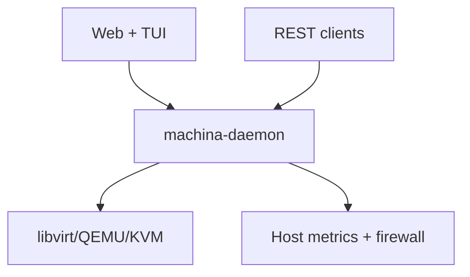

# Machina

**Enterprise Linux hypervisor management platform.**


## Customer documentation

**[docs/customer/](docs/customer/README.md)** — product-wide customer package:

| Doc | What it covers |
|-----|----------------|
| [Getting Started](docs/customer/getting-started.md) | Login, first workflows |
| [Page-by-page guides](docs/customer/pages/README.md) | How every primary screen works |
| [Complete page index](docs/customer/PAGE_INDEX.md) | All nav routes |
| [Admin basics](docs/customer/admin-basics.md) | Ports, PAM/OIDC, deploy |
| [PDFs](docs/customer/pdf/) | Printable manuals (`node scripts/customer-docs/build-customer-pdfs.mjs`) |

**[Feature Guide](docs/machina-customer-feature-guide.md)** — capability map across **12** domains ([PDF](docs/machina-customer-feature-guide.pdf)).

Unified control plane for **VMs, networks, storage, snapshots, and day-two operations** on bare-metal worker nodes — web UI with VNC/SPICE consoles, terminal UI, REST API, and `machinactl` for fleet automation. Built on **libvirt/QEMU/KVM**.

```text
┌──────────────────────────────────────────────────────────────┐
│  Interfaces   Web UI · TUI · REST API · machinactl CLI       │
├──────────────────────────────────────────────────────────────┤
│  Daemon       machina-daemon — PAM · RBAC · console proxies  │
├──────────────────────────────────────────────────────────────┤
│  Hypervisor   libvirt · QEMU/KVM · optional KubeVirt path    │
└──────────────────────────────────────────────────────────────┘
```

**Stack:** **Machina** = physical infrastructure OS. **Zeus OS** = cloud layer on top.

---

## Why Machina

| Problem | Machina answer |
|---------|----------------|
| libvirt ops scattered across virsh scripts | One dashboard + API for full lifecycle |
| Consoles need separate gateways | Built-in noVNC, SPICE, serial, SSH proxies |
| No fleet observability | Prometheus, alerts, webhooks, PSI/cgroups |
| KubeVirt migration is manual | YAML bundles + documented migration path |
| Vendor hypervisor lock-in | Open-source Rust daemon on your metal |

---

## Platform at a Glance

| Layer | What's in the repo |
|-------|-------------------|
| **Daemon** | axum REST + WebSocket — `daemon/` |
| **Web** | React 19 + xterm.js + noVNC — `web/` |
| **TUI** | ratatui terminal client — `tui/` |
| **Core** | libvirt bindings, types — `core/` |
| **CLI** | `machinactl` deploy/verify/health — root |
| **Integrations** | OpenStack, PacketWolf, Atlas storage — `docs/` |

---

## Quick Start

```bash
git clone https://github.com/ssahani/machina.git && cd machina
./machinactl deploy    # deps · build · install · start · verify

# Open https://localhost:5092 or run TUI:
machina
```

**Remote deploy:**

```bash
./scripts/deploy-remote.sh HOST USER
./scripts/package-binary-remote.sh HOST USER --fetch
```

| Scenario | Path |
|----------|------|
| Infrastructure vision | [docs/machina-infrastructure-vision.md](docs/machina-infrastructure-vision.md) |
| KubeVirt migration | [docs/kubevirt-migration.md](docs/kubevirt-migration.md) |
| Observability | [docs/guides/observability.md](docs/guides/observability.md) |
| OpenStack | [docs/openstack.md](docs/openstack.md) |

---

## Architecture


```mermaid
flowchart TB
  UI[Web + TUI] --> Daemon[machina-daemon]
  API[REST clients] --> Daemon
  Daemon --> Libvirt[libvirt/QEMU/KVM]
  Daemon --> Host[Host metrics + firewall]
```

---

## Documentation

| Goal | Document |
|------|----------|
| Docs index | [docs/README.md](docs/README.md) |
| User stories | [docs/USER_STORIES.md](docs/USER_STORIES.md) |
| Atlas storage integration | [docs/atlas-storage.md](docs/atlas-storage.md) |

## Zyvor Platform Stack

| Product | Role |
|---------|------|
| **hypercluster** | Bare-metal Kubernetes bootstrap |
| **machina** | Physical hypervisor OS (libvirt/KVM) |
| **zeus-os** | Cloud / KubeVirt control plane |
| **hermes** | Application layer for Kubernetes |
| **forge** | AI infrastructure on Kubernetes |
| **hypersdk / hyper2kvm** | Multi-cloud VM migration |
| **guestkit** | Offline VM migration assurance |
| **packetwolf** | Kernel-native network intelligence |
| **atlas** | Storage control plane (Ceph/NFS/ZFS) — VM disks, snapshots, backups |
| **Aether** | Universal runtime portability |
| **Veyron** | KubeVirt VM command center |
| **IronWolf** | Metal3 bare-metal automation |
| **zyvor-fabric** | systemd-native private cloud |

→ [zyvor.dev](https://zyvor.dev)

---

## Development

See project docs for CI, testing, and contribution guidelines. Historical build summaries in the repo root are snapshots — **`docs/` and this README are authoritative.**

---

## License

See [LICENSE](LICENSE) or project-specific licensing files in `docs/legal/`.
