# Interactive VM Migration Guide

The `hyperctl migrate` command provides an intuitive, terminal-based UI for selecting and migrating VMs from multiple cloud providers to KVM.

## 🎮 Overview

Interactive migration mode allows you to:
- Browse all available VMs with keyboard navigation
- Select multiple VMs for migration
- View detailed VM information and migration summary
- Confirm migration settings before starting
- Automatically export VMs from source cloud provider
- Auto-convert VMDKs to qcow2 format
- Optionally import to libvirt

## 🚀 Quick Start

```bash
# Launch interactive mode
hyperctl migrate

# With custom output directory
hyperctl migrate -output /migrations

# Skip auto-conversion
hyperctl migrate -convert=false

# With libvirt import (requires libvirt setup)
hyperctl migrate -import
```

## 📋 User Interface

### 1. VM Selection Screen

```
🚀 Interactive VM Migration Tool

📊 Total VMs: 201 | ✅ Selected: 3

▶ [✓] rhel9.4                                  | ON  | 2 CPU | 4.0 GB | 90 GB
  [ ] win2022                                  | OFF | 4 CPU | 8.0 GB | 120 GB
  [✓] ubuntu22.04                              | ON  | 2 CPU | 4.0 GB | 50 GB
  ...

↑/k: up | ↓/j: down | Space: select | a: select all | n: deselect all | Enter: confirm | q: quit
```

**Navigation Keys:**
- `↑` or `k` - Move up
- `↓` or `j` - Move down
- `Space` - Toggle selection
- `a` - Select all VMs
- `n` - Deselect all VMs
- `Enter` - Confirm selection and proceed
- `q` or `Ctrl+C` - Quit

### 2. Confirmation Screen

After selecting VMs, you'll see a detailed summary:

```
📋 Confirm Migration

Selected VMs for migration:

📦 rhel9.4
   Path: /data/vm/rhel9.4
   Power: poweredOn | CPU: 2 | Memory: 4.0 GB | Storage: 90 GB
   OS: Red Hat Enterprise Linux 9 (64-bit)

📦 ubuntu22.04
   Path: /data/vm/ubuntu22.04
   Power: poweredOn | CPU: 2 | Memory: 4.0 GB | Storage: 50 GB
   OS: Ubuntu Linux (64-bit)

📊 Migration Summary

Total Resources:
  🖥️  Total CPUs: 4
  💾 Total Memory: 8.0 GB
  💿 Total Storage: 140 GB

⚙️  Export Settings

Output Directory: /tmp/vm-migrations
Auto-convert to qcow2: Yes ✓
Auto-import to libvirt: No

🚀 Start migration?

y: Yes, start migration | n: No, go back | Esc/b: Back to selection | q: Quit
```

**Confirmation Keys:**
- `y` or `Y` - Start migration
- `n` or `N` - Cancel and go back to selection
- `Esc` or `b` - Back to selection screen
- `q` or `Ctrl+C` - Quit

### 3. Export Progress

```
📦 Exporting VMs

Progress: 1 / 3

✓ rhel9.4
✓ ubuntu22.04
  debian12
```

### 4. Conversion Progress

```
🔄 Converting VMDKs to qcow2...
```

### 5. Completion

```
✅ Migration Complete!

📁 rhel9.4 → /tmp/vm-migrations/rhel9.4
📁 ubuntu22.04 → /tmp/vm-migrations/ubuntu22.04
```

## ⚙️ Command Options

### Basic Options

| Option | Default | Description |
|--------|---------|-------------|
| `-output` | `/tmp/vm-migrations` | Directory to save exported VMs |
| `-convert` | `true` | Auto-convert VMDK to qcow2 |
| `-import` | `false` | Auto-import to libvirt |
| `-daemon` | `http://localhost:8080` | Daemon URL |

### Examples

**Export to custom directory:**
```bash
hyperctl migrate -output /var/lib/libvirt/images
```

**Export only (no conversion):**
```bash
hyperctl migrate -convert=false -output /exports
```

**Full automation (export, convert, import):**
```bash
hyperctl migrate -output /migrations -import
```

## 🔄 Migration Workflow

### End-to-End Process

```mermaid
flowchart TD
    Start([Launch hyperctl migrate]) --> Select[Select VMs<br/>↑/↓ Navigate<br/>Space to select<br/>Enter to continue]
    Select --> Review[Review & Confirm<br/>VM details<br/>Resource totals<br/>Export settings]
    Review -->|Press 'y'| Export[Automated Export<br/>VDDK parallel downloads<br/>Real-time progress]
    Review -->|Press 'n'/Esc| Select
    Export --> CheckConvert{Conversion<br/>enabled?}
    CheckConvert -->|Yes| Convert[Automated Conversion<br/>VMDK → QCOW2<br/>qemu-img convert]
    CheckConvert -->|No| CheckImport
    Convert --> CheckImport{Import<br/>enabled?}
    CheckImport -->|Yes| Import[Import to libvirt<br/>virt-install<br/>Network & storage config]
    CheckImport -->|No| Done([Migration Complete])
    Import --> Done

    style Start fill:#4CAF50,stroke:#2E7D32,color:#fff
    style Select fill:#2196F3,stroke:#1565C0,color:#fff
    style Review fill:#2196F3,stroke:#1565C0,color:#fff
    style Export fill:#FF9800,stroke:#E65100,color:#fff
    style Convert fill:#9C27B0,stroke:#6A1B9A,color:#fff
    style Import fill:#009688,stroke:#00695C,color:#fff
    style Done fill:#4CAF50,stroke:#2E7D32,color:#fff
    style CheckConvert fill:#FFC107,stroke:#F57C00,color:#000
    style CheckImport fill:#FFC107,stroke:#F57C00,color:#000
```



**Detailed Steps:**

1. **Launch Interactive Mode:**
   ```bash
   hyperctl migrate -output /migrations
   ```

2. **Select VMs:**
   - Navigate with arrow keys or `j`/`k`
   - Press `Space` to select/deselect
   - Press `a` to select all matching criteria
   - Press `Enter` when ready

3. **Review & Confirm:**
   - Review VM details and resource totals
   - Check export settings
   - Press `y` to confirm or `n`/`Esc` to go back

4. **Automated Export:**
   - VMs are exported using VDDK (parallel downloads)
   - Progress displayed in real-time
   - Each VM saved to `{output-dir}/{vm-name}/`

5. **Automated Conversion** (if enabled):
   - VMDK files converted to qcow2
   - Original VMDKs preserved
   - Conversion uses `qemu-img convert`

6. **Import to libvirt** (if enabled):
   - VMs imported with `virt-install`
   - Proper OS detection and optimization
   - Network and storage configured

## 📊 Output Structure

After migration, files are organized as:

```
/migrations/
├── rhel9.4/
│   ├── rhel9.4.ovf          # OVF descriptor
│   ├── rhel9.4.vmdk         # Original VMDK
│   ├── rhel9.4.qcow2        # Converted qcow2
│   └── rhel9.4.mf           # Manifest
├── ubuntu22.04/
│   ├── ubuntu22.04.ovf
│   ├── ubuntu22.04.vmdk
│   ├── ubuntu22.04.qcow2
│   └── ubuntu22.04.mf
└── ...
```

## 🎯 Use Cases

### Use Case 1: Migrate Development Environment

```bash
# Scenario: Migrate 5 dev VMs to local KVM
hyperctl migrate -output /dev-vms

# In interactive mode:
1. Filter to dev VMs visually
2. Select all 5 VMs with spacebar
3. Confirm migration
4. Wait for completion
5. VMs ready at /dev-vms/
```

### Use Case 2: Selective Production Migration

```bash
# Scenario: Migrate specific production VMs
hyperctl migrate -output /prod-migration

# In interactive mode:
1. Browse all VMs
2. Carefully select only target VMs
3. Review total resources
4. Confirm settings
5. Monitor export progress
```

### Use Case 3: Export for Archival

```bash
# Scenario: Export VMs for archival (no conversion)
hyperctl migrate -output /archives -convert=false

# In interactive mode:
1. Select VMs to archive
2. Export only (no conversion)
3. VMDKs saved with OVF descriptors
```

## 💡 Tips & Best Practices

### Performance Tips

1. **Network Bandwidth:**
   - Interactive mode uses parallel downloads (default: 8 streams)
   - Ensure good network connectivity to vCenter
   - Monitor with: `iftop -i eth0`

2. **Disk Space:**
   - Check available space before starting
   - Each VM needs space for VMDK + qcow2
   - Run: `df -h /migrations`

3. **Resource Planning:**
   - Review summary before confirming
   - Consider storage and memory requirements
   - Plan KVM host capacity

### Selection Tips

1. **Quick Selection:**
   - Use `a` to select all, then deselect unwanted VMs
   - Or select individually for precise control

2. **Visual Verification:**
   - Check power state (ON/OFF indicator)
   - Verify resource allocation (CPU/Memory)
   - Confirm VM names and paths

3. **Going Back:**
   - Use `Esc` or `b` anytime in confirmation
   - Selection is preserved when going back
   - Change selections and re-confirm

### Migration Tips

1. **Pre-Migration:**
   - Shutdown VMs gracefully before migration
   - Remove CD/DVD devices first
   - Verify VMware Tools installed

2. **During Migration:**
   - Don't interrupt the process
   - Monitor daemon logs if issues occur
   - Check available disk space

3. **Post-Migration:**
   - Verify converted qcow2 images
   - Test VMs before removing originals
   - Update documentation

## 🔧 Troubleshooting

### Issue: "No VMs displayed"

**Cause:** Daemon not connected to vCenter

**Solution:**
```bash
# Check daemon status
sudo systemctl status hypervisord

# Check daemon logs
sudo journalctl -u hypervisord -f

# Verify vCenter credentials
echo $GOVC_URL
```

### Issue: "Export failed"

**Cause:** Various (network, permissions, storage)

**Solution:**
```bash
# Check daemon logs for specific error
sudo journalctl -u hypervisord -n 100

# Verify network connectivity
ping vcenter.example.com

# Check disk space
df -h /migrations

# Retry with same selections
hyperctl migrate
```

### Issue: "Conversion failed"

**Cause:** qemu-img not installed or disk space

**Solution:**
```bash
# Install qemu-img
sudo dnf install qemu-img  # Fedora/RHEL
sudo apt install qemu-utils  # Ubuntu/Debian

# Check disk space
df -h /migrations

# Manually convert if needed
qemu-img convert -f vmdk -O qcow2 input.vmdk output.qcow2
```

### Issue: "Import to libvirt failed"

**Cause:** libvirt not configured or permissions

**Solution:**
```bash
# Verify libvirt running
sudo systemctl status libvirtd

# Check permissions
sudo usermod -aG libvirt $USER

# Test libvirt connection
virsh list --all

# Manual import
virt-install --import --disk /migrations/vm/disk.qcow2 ...
```

## 📚 Related Documentation

- [hyperctl Features](H2KVMCTL-FEATURES.md) - All CLI features
- [VM Export Guide](VM-EXPORT-GUIDE.md) - Detailed export guide
- [Examples](../examples/README.md) - Configuration examples
- [API Reference](API.md) - REST API documentation

## 🎨 Keyboard Shortcuts Reference

### Selection Screen
| Key | Action |
|-----|--------|
| `↑` / `k` | Move cursor up |
| `↓` / `j` | Move cursor down |
| `Space` | Toggle selection |
| `a` | Select all |
| `n` | Deselect all |
| `Enter` | Proceed to confirmation |
| `q` / `Ctrl+C` | Quit |

### Confirmation Screen
| Key | Action |
|-----|--------|
| `y` / `Y` | Confirm and start |
| `n` / `N` | Cancel |
| `Esc` / `b` | Back to selection |
| `q` / `Ctrl+C` | Quit |

## 🌟 Advanced Usage

### Pre-filtering VMs

First list VMs to understand what's available:
```bash
# See all VMs
hyperctl list

# Filter to specific VMs
hyperctl list -filter prod
```

Then launch interactive mode knowing what to look for.

### Batch Migration Script

Combine with shell scripting for automated workflows:
```bash
#!/bin/bash
# migrate-all.sh

# Set output directory
OUTPUT="/var/lib/migrations"
mkdir -p "$OUTPUT"

# Launch interactive mode
hyperctl migrate -output "$OUTPUT" -convert -import

# Post-migration verification
for vm_dir in "$OUTPUT"/*; do
    if [ -f "$vm_dir/*.qcow2" ]; then
        echo "✅ $(basename $vm_dir) migrated successfully"
    else
        echo "❌ $(basename $vm_dir) migration failed"
    fi
done
```

### Integration with Monitoring

Monitor migration progress:
```bash
# Terminal 1: Run migration
hyperctl migrate

# Terminal 2: Monitor daemon
sudo journalctl -u hypervisord -f

# Terminal 3: Monitor resources
watch -n 1 'df -h /migrations; echo; iostat -x'
```

---

**🎉 Enjoy the Interactive Migration Experience!**

The interactive mode makes VM migration simple, visual, and error-free. Happy migrating!
