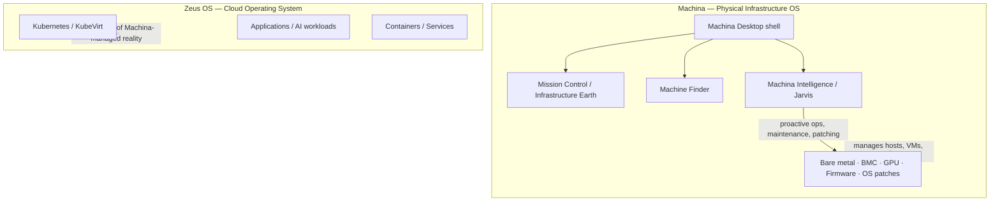

# Machina Infrastructure OS — Vision

Machina is the **physical infrastructure operating system**: bare metal, hypervisors, VMs, BMC, GPU inventory, firmware, and OS patching. **Zeus OS** is the **cloud layer** on top — Kubernetes, KubeVirt, applications, and AI workloads.

See also: [`zeus-os-vision.md`](zeus-os-vision.md) (Zeus scope), [`machina-zeus-os-vision.md`](machina-zeus-os-vision.md) (AI-native OS roadmap), [`machina-macos-os-manager-roadmap.md`](machina-macos-os-manager-roadmap.md) (macOS metaphor phases).

---

## Two-layer stack

| Layer | Owns | Does not own |
|-------|------|--------------|
| **Machina** | Hosts, libvirt/QEMU, storage pools, host networking, BMC/IPMI, fleet patching, Mission Control geography | K8s control plane internals, app deployment |
| **Zeus OS** | KubeVirt clusters, workloads, Zeus Firewall cloud/K8s profiles, app fabric | Physical rack layout, hypervisor install |

**Machina Intelligence** (Jarvis, Copilot, SRE forecast, Doctor) operates across both layers but **grounds decisions in physical reality** — host pressure, SMART, thermal, maintenance windows — before cloud actions.

---

## Machina Desktop (shell metaphor)

The Platform shell at `/platform/*` is the **Machina Desktop**:

| macOS surface | Machina equivalent | Status |
|---------------|-------------------|--------|
| Desktop / wallpaper | Fleet dashboard + dock | Shipped |
| Jarvis / Siri strip | `PlatformJarvisBriefing` — morning briefing | Shipped (v1) |
| Dynamic Island | `PlatformDynamicIsland` — health pill in menubar | Shipped (v1) |
| Mission Control (F3) | `MissionControlOverlay` — Infrastructure Earth | Shipped (v1) |
| Dock | Machines · VMs · Storage · Network · GPU · Terminal | Shipped (v1) — GPU at `/platform/gpu` (Batch 64) |
| Finder | VM-centric Finder (`PlatformFinderShell`) | **Partial** — VM smart folders + **Machine Finder geography** at `/platform/hosts/finder` (Batch 63) |
| System Settings | Host + fleet settings hub | Shipped |

**Normal tier:** briefing + dock only. **Power/Advanced:** stat widgets, activity, full dock.

---

## Mission Control / Infrastructure Earth

Mission Control is an **in-shell overlay** (Exposé-style), not a separate full-screen route.

### v1 — Logical geography (shipped)

- Host metadata: `site`, `rack`, `rack_u` on `hosts` table
- `GET /api/v1/fleet/mission` — site → rack → host tree + summary
- **2.5D UI:** CSS perspective columns, **Living Server** cards (CPU/mem bars, VM count)
- Deep link: `/platform?mission=1` or F3 / View → Mission Control

### v2 — Physical feeds (later)

- Live BMC/Redfish rack slot inventory
- GPU discovery agent → GPU Command Center
- Animated 3D datacenter (after 2.5D UX validation)

---

## Phased horizons

| Horizon | Feature | Notes |
|---------|---------|-------|
| **Now** | Jarvis landing, Dynamic Island, Mission Control Earth v1, Machine Finder geography, GPU Command Center, Maintenance Mission, Infrastructure DNA | Layer 0 phases 49–56 |
| **Next** | Full Jarvis (minimal menus) | Intent router expansion |

---

## API additions (Infrastructure OS v1)

| Endpoint | Purpose |
|----------|---------|
| `GET /api/v1/fleet/mission` | Site/rack/host geography + health summary |
| `PATCH /api/v1/hosts/{id}` | Set `site`, `rack`, `rack_u` |
| `GET /api/v1/fleet/desktop` | Jarvis + Dynamic Island fleet rollup |
| `GET /api/v1/fleet/gpu` | GPU host/VM inventory + MIG/vGPU/CUDA profile rollup |
| `GET /api/v1/fleet/maintenance-mission` | Per-host 7-step patch mission plan (scan → verify) |
| `GET /api/v1/fleet/dna` | Fleet health score 0–100 + pillar breakdown |

Spotlight intents: `open mission control`, `infrastructure health`, `show overheating hosts`.

---

## Success criteria (v1)

1. `/platform/` and `/platform/vms` load without JS crash
2. F3 / View → Mission Control opens overlay inside Platform shell
3. `/platform` shows Jarvis briefing with live fleet counts
4. Menubar Dynamic Island shows health state and expands on alert
5. Mission Control displays hosts grouped by site/rack (metadata v1)
6. E2E: `platform-vms.spec.ts`, `platform-mission-control.spec.ts`

---

## Explicit non-goals (this cycle)

- WebGL Infrastructure Earth globe
- Autonomous patch apply on hypervisors (guided orchestration only; preview/link-out)

See [`enterprise-backlog.md`](enterprise-backlog.md) for deferred enterprise items.

For gap analysis and OpenStack/K8s integration status, see [`backend-ux-wiring-audit.md`](backend-ux-wiring-audit.md).

---

## API ↔ UI map (Backend UX parity)

| API domain | Primary UI surface |
|------------|-------------------|
| `GET /api/v1/audit` | Console → Controller audit log (`/platform/events`) |
| `GET /api/v1/operations/executions` | Reports → Runbooks tab |
| `GET /api/v1/ai/sre/remediate`, `/compliance/remediate` | Dashboard, Recommendations (RemediateChips) |
| `GET /api/v1/ai/memory/similar` | Topology → Similar incidents |
| `GET /api/v1/hosts/{id}/linux/updates` | Host detail → Linux → Package updates |
| `GET /api/v1/vms/{id}/migrations` | VM detail → Events → Migration history |
| `GET/POST /api/v1/policy/rules`, `/policy/quotas` | `/platform/policy`, Settings → Security |
| `POST/GET /api/v1/guestkit/jobs` | Migration → GuestKit jobs tab |
| `POST /api/v1/zeus-firewall/policies/gitops/sync` | Firewall Compliance → Sync GitOps |
| `GET/POST /api/v1/zeus-firewall/policies`, `/simulate` | `/platform/zeus/security/policies` |
| `GET /api/v1/zeus-firewall/multisite/*` | Firewall overview → Multi-site tabs |
| `GET /api/v1/fleet/prometheus` | Observability → Fleet Prometheus link |
| `GET /api/v1/enterprise/air-gap/bundles/{id}` | Settings → Security → Air-gap bundle detail |
| `PATCH /api/v1/storage/pools/{id}` | Storage → Pools → Edit capacity |
| `POST /network/segments/{id}/emergency-unlock` | Networks → Segments → Unlock |
| `POST /api/v1/hosts/{id}/upgrade` | Maintenance → Upgrade agent |
| `GET /api/v1/fleet/{network,storage,updates,…}` | `FleetSettingsPane` on Settings, Storage, Networks, Maintenance |

Spotlight intents cover audit log, policy, GuestKit jobs, firewall policies, fleet Prometheus, and SRE remediate routes.

