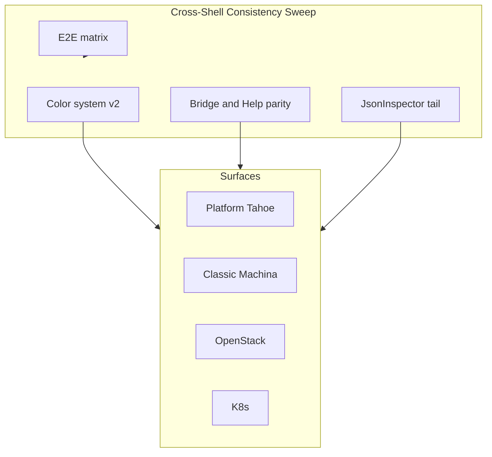

# Next Big Sweep — Machina Web

Planning doc for the **next consolidated UX + shell pass** on the `machina` repo (`web/`).  
For Zeus CloudOS (`ui/`) and PacketWolf pro UI (`web-ui/`), see [Out of repo](#out-of-repo) below.

## Shipped sweeps (2026-05)

| Sweep | Commits (approx.) | Scope |
|-------|-------------------|--------|
| **Tahoe Nav Big Sweep** | `98a1410` | [`platformNavRegistry.ts`](../web/src/utils/platformNavRegistry.ts), Spotlight zones (Settings/Ops/Resources/Security/Zeus), CommandPalette platform dedupe, dead `PlatformMenuBar`, tier-aware links, nav e2e |
| **Overall UX Polish (P14)** | `0ff5cd4` | Empty states, host/network CTAs, Fleet/NodeInfo, K8s can-i card, platform command review e2e |
| **Batch 48 + Tahoe classic + colors v1** | `7534747` | [`platform-batch-48.spec.ts`](../web/e2e/platform-batch-48.spec.ts), `tahoe-page-root` on classic shell, [`semanticColors.ts`](../web/src/utils/semanticColors.ts) |
| **Batch 57 Cross-Shell Consistency** | `bea8280`–`098f4ad` + follow-up | semanticColors v2 + classic/OpenStack/K8s/Platform badge migration; Help → Platform tab + tier-aware shell bridge; CollapsibleCodeBlock operator UX; [`cross-shell.spec.ts`](../web/e2e/cross-shell.spec.ts); classic operator pages (NodeInfo, Storage, Networks, Services, SystemCheck, Events, …); hub link tokens on 37+ platform pages |
| **Batch 58 Color Tail** | `3f3c332` | Zeus Firewall security pages + `riskTone`; platform dashboard/widget status chips; VMDetails warn/error surfaces; shared primitives (GlassButton danger, FilterPills, BuildStepTimeline, KubeVirt modal, AI panels); classic focus-ring token parity on Logs/NodeInfo/Backups |
| **Batch 59 Platform Color Tail** | (this PR) | Remaining platform status surfaces (Events, Security Center, Observability, Notifications, Content, Migration, Reports, …); `utilizationBarClass`; Settings/HostNetworking warn callouts |

**Verification baseline**

```bash
cd web && npm run test && npm run build
cd web && npm run test:e2e -- e2e/platform-batch-48.spec.ts e2e/platform-nav-coverage.spec.ts e2e/platform-full.spec.ts e2e/cross-shell.spec.ts e2e/shell-bridge.spec.ts
```

---

## Goal of the next sweep

**Batch 57–59 shipped (2026-05-30).** Color tail largely complete on platform operator pages. Remaining optional polish: `ChoiceCards` selection accents (intentional), decorative integration brand colors (OpenStack sky, GuestKit orange), macOS Tahoe in `ui/`, PacketWolf tokens in `web-ui/`.

One reviewable PR that makes **all four shells** (Platform, Classic, OpenStack, K8s) feel like the same product:

- Same **status colors**, glass cards, and readable typography
- Same **return path** to Platform desktop (shell bridge + tier-safe hub links)
- Same **operator UX** (no raw JSON as primary content; actionable errors)
- Same **confidence in CI** (tier × route matrix + batch-48 regressions)



---

## Track A — Color system v2 (machina)

**Status:** Shipped in Batch 57 — tokens, maps, classic/OpenStack/K8s/Platform status badges, NodeInfo/Storage/Backups gauges, CommandPalette network/pool badges.

**Extend**

| Layer | Files | Work |
|-------|-------|------|
| Tokens | [`main.css`](../web/src/styles/main.css) | Add `--machina-accent-network`, `--machina-accent-security`, `--machina-accent-ai`; document usage in a short comment block |
| Maps | [`semanticColors.ts`](../web/src/utils/semanticColors.ts) | `openstackStatusTone`, `k8sPhaseTone`, `integrationPhaseTone`; badge class helpers |
| Primitives | [`EmptyState.tsx`](../web/src/components/EmptyState.tsx), [`ErrorBanner.tsx`](../web/src/components/ErrorBanner.tsx), [`vm.ts`](../web/src/utils/vm.ts) `getStateBadgeClasses` | Route status colors through semantic maps |
| Classic | [`Dashboard.tsx`](../web/src/pages/Dashboard.tsx), [`Fleet.tsx`](../web/src/pages/Fleet.tsx), [`VMList.tsx`](../web/src/pages/VMList.tsx) | Replace ad-hoc `text-emerald-400` / `text-amber-400` / `text-red-400` |
| OpenStack | List + detail pages under [`web/src/pages/OpenStack*.tsx`](../web/src/pages/) | Badge maps → `semanticColors` |
| K8s | [`K8sOverview.tsx`](../web/src/pages/K8sOverview.tsx), [`K8sWorkloads.tsx`](../web/src/pages/K8sWorkloads.tsx) | Pod/phase chips use tokens |

**Acceptance:** `rg 'text-emerald-400|text-green-400|text-amber-400|text-red-400' web/src/pages web/src/components --glob '*.tsx'` trending down; no contrast regressions on dark / steel / aurora themes.

---

## Track B — Shell bridge & Help parity

**Status:** Shipped — Platform Help → Platform guide; tier-aware shell bridge; cross-shell e2e.

**Gaps today**

| Surface | Issue |
|---------|--------|
| Platform **Help** menubar | Opens doc links only — does not open [`HelpDialog`](../web/src/components/HelpDialog.tsx) **Platform** tab (Classic `?` does) |
| [`ShellBridgeBar`](../web/src/components/ShellBridgeBar.tsx) | Integrations link not tier-filtered; hub links should use [`hubHrefForTier`](../web/src/utils/platformHubLinks.ts) where applicable |
| Classic shell | `tahoe-page-root` applied — needs spot-check on Dashboard tables and Fleet `PageHeader` duplication |

**Work**

1. Platform Help menu: add **Platform guide** item → `onOpenHelp('platform')` (wire from [`PlatformMacAppMenus.tsx`](../web/src/components/platform/mac/PlatformMacAppMenus.tsx) via layout callback).
2. Shell bridge: tier-aware `/platform` and `/platform/integrations` (hide integrations on tiers where hub is blocked).
3. Fleet: drop redundant [`PageHeader`](../web/src/components/PageHeader.tsx) or wrap in Tahoe hero pattern for visual parity with Hosts/VMs.

**E2e:** extend [`shell-bridge.spec.ts`](../web/e2e/shell-bridge.spec.ts) + one test for Help → Platform tab on `/platform/vms`.

---

## Track C — JsonInspector & operator surfaces (P14 tail)

**Status:** Shipped — VMDetails KubeVirt blocks, OpenStackInstanceDetail errors, K8sOverview etcd/inventory, PlatformReports CTAs.

Most P14 targets are shipped ([`backend-ux-wiring-audit.md`](backend-ux-wiring-audit.md) P14). Remaining high-traffic gaps:

| Priority | File | Change |
|----------|------|--------|
| P1 | [`VMDetails.tsx`](../web/src/pages/VMDetails.tsx) | KubeVirt bundle / exec output — keep YAML/logs as text; add collapse + copy; optional summary card for last command exit |
| P1 | [`OpenStackInstanceDetail.tsx`](../web/src/pages/OpenStackInstanceDetail.tsx) | Long-fetch skeleton; action errors via [`openstackHints.ts`](../web/src/utils/openstackHints.ts) |
| P2 | [`K8sOverview.tsx`](../web/src/pages/K8sOverview.tsx) | etcd/inventory sections — table first where not already done |
| P2 | [`PlatformReports.tsx`](../web/src/pages/platform/PlatformReports.tsx) | Runbook empty + export actions use `PlatformEmptyState` CTAs consistently |

**Out of scope:** [`ApiDocs.tsx`](../web/src/pages/ApiDocs.tsx), API Console try-it responses (JSON intentional).

---

## Track D — E2E & live verification matrix

**Status:** Shipped — 69 local e2e green (batch-48, nav-coverage, platform-full, cross-shell, shell-bridge).

**Playwright (local CI)**

| Suite | Add / extend |
|-------|----------------|
| [`platform-full.spec.ts`](../web/e2e/platform-full.spec.ts) | Normal-tier smoke for `/platform/backups`, `/platform/storage`; advanced firewall policy studio (already partial) |
| [`platform-batch-48.spec.ts`](../web/e2e/platform-batch-48.spec.ts) | Help Platform tab (once Track B ships); template **not ready** path (mock readiness `ready: false`) |
| [`platform-nav-coverage.spec.ts`](../web/e2e/platform-nav-coverage.spec.ts) | `import networks` command; Resources mobile jump |
| New `cross-shell.spec.ts` | Classic `/storage` empty → bridge → `/platform`; OpenStack subnav → Platform |

**Live (optional, pre-deploy)**

```bash
VSPASS='…' ./scripts/e2e-live-ux-remote.sh sus 212.8.252.194
# or deploy with --e2e per backend-ux-wiring-audit P12
```

**Target:** 70+ local e2e green; batch-48 + nav-coverage required on every PR touching shell/nav.

---

## Track E — Backend ops hooks (parallel, small)

Supports Phase 7 roadmap batches 57–66 ([`platform-roadmap.md`](platform-roadmap.md)) without blocking UI sweep:

| Item | Backend | UI hook |
|------|---------|---------|
| Host stale in UI tests | Already in [`hosts.rs`](../controller/src/api/hosts.rs) `apply_stale_host_state` | E2e mocks API response; optional controller unit test |
| Runbook catalog empty state | `GET /api/v1/runbooks` | [`PlatformReports.tsx`](../web/src/pages/platform/PlatformReports.tsx) CTA |
| Storage discover idempotency | `POST /api/v1/storage/pools/discover` | Batch-48 e2e covers happy path |

Defer Vault/MFA, multi-site DR, in-browser RDP per [`enterprise-backlog.md`](enterprise-backlog.md).

---

## Suggested implementation order

1. **Track D** — extend e2e first (locks regressions before wide CSS churn).
2. **Track A** — semanticColors + classic/OpenStack/K8s badge pass (highest visual ROI).
3. **Track B** — Help + shell bridge (user-visible nav polish).
4. **Track C** — JsonInspector tail (page-by-page, low conflict).
5. **Track E** — only if API gaps block UI CTAs.

Estimated touch: **~25–35 files**, **~500–800 LOC** net (mostly token swaps + e2e).

---

## Explicit decisions (no change)

- **`/platform/reports`** stays under **Operations** context in nav registry.
- **Normal tier** Go menu hides Operations hub until Power unlock (filter by hub visibility, not `hubHrefForTier` alone).
- **Desktop tabs row** remains removed; Window menu + Mission Control only.
- **No new routes** in this sweep — presentation and cross-shell consistency only.

---

## Out of repo

These plans apply to **other codebases**, not `machina/`:

| Plan | Repo path | Theme |
|------|-----------|--------|
| macOS Tahoe App-Wide | `ui/` | CloudOS `RoutedViewShell` archetypes, TahoeHero, ConfirmDialog → TahoeSheet |
| Color System Big Sweep | `web-ui/` | `--pw-*` tokens, GlassBadge, 60+ pro views |
| Tahoe Big Sweep (Zeus desktop) | `ui/` | Visual regression PNGs, ops deep-links, Forecasting tokens |

When those repos are in scope, run their plans there; do not duplicate work in `web/` except where Machina shell bridge overlaps.

---

## Success criteria

After the sweep, a reviewer should see:

- Classic `/`, `/vms`, `/fleet`, `/storage` use glass cards and semantic status colors without layout regressions.
- Platform **Help → Platform** matches Support page guidance.
- Spotlight + mobile jump + context bar unchanged (nav registry is stable — extend, don’t fork).
- `npm run test`, `npm run build`, and the e2e bundle above all green.
- [`docs/ux.md`](ux.md) updated with semantic color usage; [`platform-roadmap.md`](platform-roadmap.md) batch **57** row marked for cross-shell sweep.

---

## Related docs

- [ux.md](ux.md) — integration phases, primitives, P14 QA table
- [platform-ux-vision.md](platform-ux-vision.md) — macOS metaphor north star
- [backend-ux-wiring-audit.md](backend-ux-wiring-audit.md) — P6–P14 wiring checklist
- [platform-roadmap.md](platform-roadmap.md) — batch status and Phase 7+ backend themes
- [machina-macos-os-manager-roadmap.md](machina-macos-os-manager-roadmap.md) — long-horizon macOS app map (Phases 48–237)
